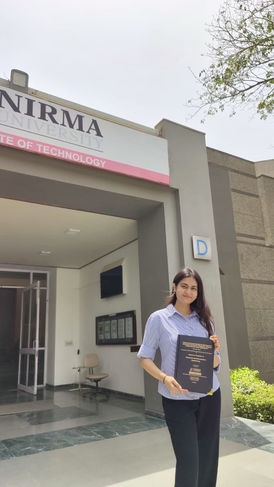

<div align="center">

```
┌─────────────────────────────────────────────────────────┐
│                                                         │
│   > SYSTEM BOOT...                                      │
│   > LOADING PROFILE: brionysayani                       │
│   > STATUS: ONLINE ██████████ 100%                      │
│                                                         │
└─────────────────────────────────────────────────────────┘
```


<br/>



<br/><br/>


</div>

---

<div align="center">

## `📊 github_stats.exe`


&nbsp;&nbsp;

&nbsp;&nbsp;


</div>

---

<details>
<summary align="center"><b>> ✨ CLICK ME ✨</b></summary>

<br/>

<div>

```
Name             :  Briony Sayani
Current Location :  Bengaluru, Karnataka, India
Education        :  B.Tech in Electronics & Instrumentation Engineering
                    Nirma University, Ahmedabad | Class of 2026

Interests        :  Dev stuff & Tri-Athlete (Run, Swim, Bike)
Currently        :  Building AI agents and multi-agent workflow automation
```

</div>

---

<div align="center">

## `> ls skills/`

**// core stack**


<br/><br/>

**// backend, cloud & tools**


<br/><br/>

**// ai / automation**

```
[ OpenAI ]  [ Gemini ]  [ LLMs ]  [ Prompt Engineering ]  [ LangGraph ]  [ RAG ]
[ AI Agents ]  [ Multi-Agent Systems ]  [ Vector Retrieval ]
[ n8n ]  [ MCP ]  [ Workflow Automation ]  [ API Integration ]
[ Webhooks ]  [ REST APIs ]  [ WebRTC ]
```

</div>

---

<div align="center">

## `> cat experience.log`

```
[★] AI Automation Intern .... Fortiv Solutions | Jan 2026 - Jun 2026
    Built and deployed AI-powered backend systems with Python, FastAPI, LLMs,
    databases, and REST APIs to automate business workflows.
    Developed OpenAI, Gemini, Supabase, and third-party API agent pipelines;
    engineered retries, logging, API monitoring, real-time tracking, and alerts.
```

</div>

---

<div align="center">

## `> cat research.log`

```
[★] Agentic Architecture Enabling Secure and Fault-Tolerant Telesurgery
    IEEE Germany Section - ICCCMLA 2025 | November 2025
    Designed an agentic AI architecture to address DDoS attacks, latency,
    packet loss, and communication failures in satellite-assisted telesurgery.
    Achieved 94% validation accuracy with a compact 0.5 MB model.
```

[](https://ieeexplore.ieee.org/document/11580659)

</div>

---

<div align="center">

## `> ./connect.sh`

[](https://www.linkedin.com/in/briony-sayani/)
[](https://github.com/brionysayani)
[](https://x.com/brionysayani)

<br/><br/>

```
📬  brionysayani51@gmail.com
```

</div>

---

<div align="center">

```
> session terminated
> thanks for visiting _
```


</div>

</details>
